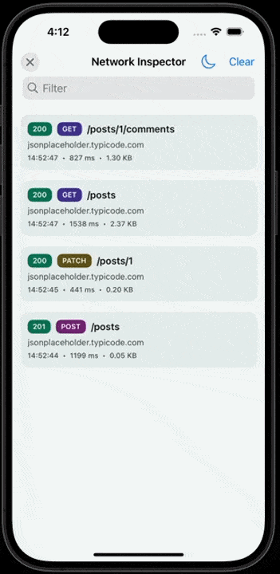

<p align="center">
  
</p>

# capacitor-pica-network-logger

A Capacitor plugin for logging and inspecting HTTP requests with native inspector UIs on iOS and Android.



## Features

- Request/response pair logging with automatic correlation
- Native inspector UI on iOS (UIKit) and Android (Jetpack Compose + Material 3)
- Body text search with highlighting in the inspector
- Persistent log storage (SQLite) across inspector sessions
- Responsive Android layout (compact, medium, expanded breakpoints)
- Dark/light theme toggle
- Configurable header and JSON body field redaction
- Configurable max body size with truncation
- Local notifications on each completed request (tap to open inspector)
- Export as cURL, plain text, or HAR 1.2
- No-op on web -- safe to import in any environment

See the [Changelog](CHANGELOG.md) for a full history of changes.

## Platform requirements

| Platform | Minimum version |
|---|---|
| Capacitor | 7+ |
| iOS | 14.0 |
| Android | API 23 (Android 6.0) |

## Installation

```bash
npm install capacitor-pica-network-logger
npx cap sync
```

## Configuration

Add to your app's `capacitor.config.ts`:

```ts
plugins: {
  PicaNetworkLogger: {
    maxBodySize: 131072,        // max chars per body (default: 128 KB)
    notify: true,               // show notifications per request (default: true)
    redactHeaders: ["authorization", "cookie"],   // header names to redact (default: none)
    redactJsonFields: ["password", "token"]        // JSON field names to redact (default: none)
  }
}
```

| Option | Type | Default | Description |
|---|---|---|---|
| `maxBodySize` | `number` | `131072` | Maximum characters stored per request/response body. Truncated beyond this. |
| `notify` | `boolean` | `true` | Post a local notification for each completed request. On Android 13+ requests `POST_NOTIFICATIONS` permission. |
| `redactHeaders` | `string[]` | `[]` | Header names (case-insensitive) whose values are replaced with `[REDACTED]`. |
| `redactJsonFields` | `string[]` | `[]` | Top-level JSON body field names (case-insensitive) whose values are replaced with `[REDACTED]`. |

## Usage

The plugin exposes three methods: `startRequest`, `finishRequest`, and `openInspector`. Use your own HTTP client (e.g. `fetch`) and wrap calls with the logging methods:

```ts
import { PicaNetworkLogger } from 'capacitor-pica-network-logger';

// 1. Log the start of a request
const { id } = await PicaNetworkLogger.startRequest({
  method: 'GET',
  url: 'https://jsonplaceholder.typicode.com/posts/1',
  headers: { 'Accept': 'application/json' },
});

// 2. Make the actual HTTP call
const response = await fetch('https://jsonplaceholder.typicode.com/posts/1');
const body = await response.text();

// 3. Log the completion
await PicaNetworkLogger.finishRequest({
  id,
  status: response.status,
  headers: Object.fromEntries(response.headers.entries()),
  body,
});

// 4. Open the inspector UI
await PicaNetworkLogger.openInspector();
```

### API

| Method | Signature | Description |
|---|---|---|
| `startRequest` | `(options: StartRequestOptions) => Promise<{ id: string }>` | Log the start of a request. Returns an `id` for correlation. |
| `finishRequest` | `(options: FinishRequestOptions) => Promise<void>` | Log the completion of a request (status, headers, body, error). |
| `openInspector` | `() => Promise<void>` | Open the native inspector UI. |

### Types

```ts
interface StartRequestOptions {
  method: string;
  url: string;
  headers?: Record<string, string>;
  body?: unknown;
}

interface FinishRequestOptions {
  id: string;
  status?: number;
  headers?: Record<string, string>;
  body?: unknown;
  error?: string;
}
```

## Project layout

```
src/            TypeScript plugin registration and types
ios/Plugin/     Swift iOS plugin (UIKit inspector, SQLite storage, notifications)
android/        Kotlin Android plugin (Compose inspector, SQLite storage, notifications)
examples/       Sample Capacitor app for manual testing
scripts/        Release script
```

## Build

From the repo root:

```bash
npm install
npm run build
```

## Sample app

```bash
cd examples/sample-app
npm install
npm run dev
```

Run on device:

```bash
# iOS
cd examples/sample-app && npm run build && npx cap sync ios && npx cap run ios

# Android
cd examples/sample-app && npm run build && npx cap sync android && npx cap run android
```

## Release

```bash
npm run release              # prompts for patch/minor/major
npm run release -- patch     # patch bump
npm run release -- 1.0.0     # explicit version
```

The release script updates `CHANGELOG.md`, bumps `package.json`, builds, commits, tags, pushes, publishes to npm, and creates a GitHub Release (if `gh` CLI is available).

## License

MIT
